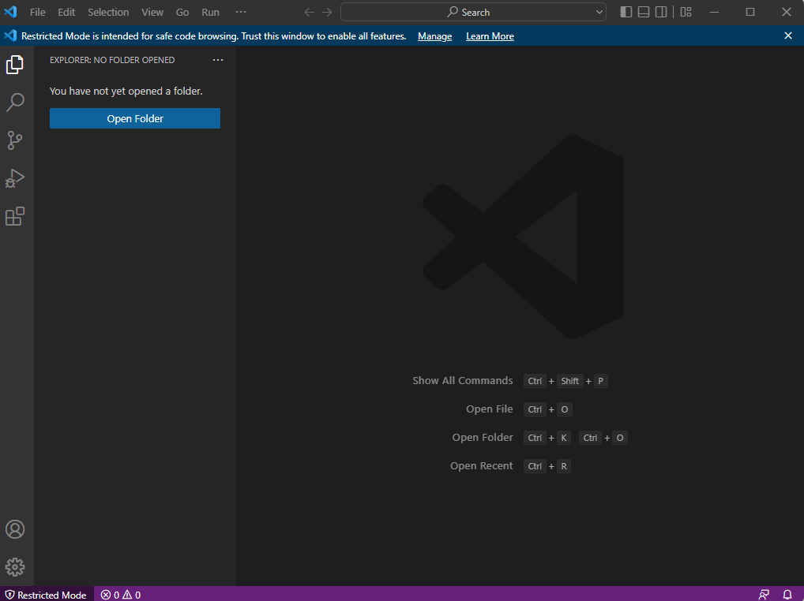

**Christopherian Week 1 Lab Report**

Step 1: Installing VS Code -  Installing VSC is done by going into their website and clicking install VS IDE of whichever version your laptop is. Mine for example, is Windows. The instructions should be listed in the website.

Step 2: Remotely Connecting - To start this process, we first install OPENSSH Client and OPENSSH Version in Windows. Before remotely connecting, you would have to change your account password. This may take up to an hour to occur. We then open VS Code terminal and we type in "ssh cs15lfa22xx@ieng6.ucsd.edu", where xx is your two code. Type in your password and it should log you in the ieng6 remote server.

Step 3: Trying some commands - For this step, we can log in to the ieng6 remote server at UCSD with our account name and start testing out commands such as scp, cat, ls, and much more.

Step 4: Moving Files with scp - Copying files with scp can go both ways. From your local workstation to a remote server, or vice versa. In this one, we will be copying a file from our local workstation to the remote server. We will be copying the file WhereAmI.java from my desktop to the remote server by using the command "scp WhereAmI.java cs15lfa22xx@ieng6.ucsd.edu:~/". Make sure to do this in your desktop directory for it to work. I unfortunately don't have the screenshot of me doing this initially, but I will put a screenshot of the after result proving that i did in fact, copied the file from my desktop to the remote server.

Step 5: Setting an SSH Key - Setting up an SSH Key is fairly simple. We first go to our local computer client. We then type in ssh-keygen. Now this will ask a few questions to the user. We press enter when the program asks which file it is, where you want to save the key. You also have the option to make a passphrase. Personally, I did not make one, as I don't want to have to keep on entering the passphrase when logging into ieng6. Afterward, you can call mkdir .ssh. Finally, just copy it back to the local device using scp command. (Unfortunately I did this step during the lab we had today in person. I did not take a screenshot and have lost the history from the VSC terminal. I do, however, have the proof of me logging into ieng6 without a password. I will substitute my missing pictures with the pictures given in the tutorial of the docs you provided us with. I hope this is okay.)

Step 6: Optimizing Remote Running - We can optimize some commands for Remote running. For example, writing a command in quotes at the end of an ssh command would run it on the remote server. We can also implement the use of semicolons to run more than 1 command on the same line in the terminal.

