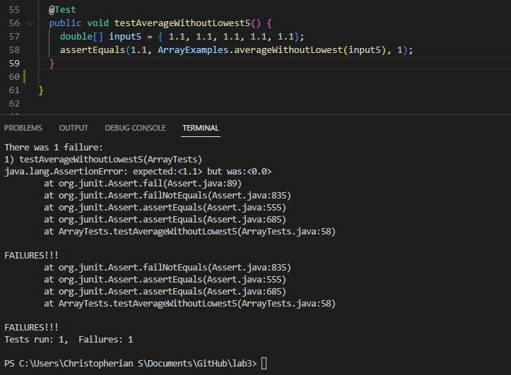

 **Week3-lab-report Christopherian Austin Sulaiman :)**

**_Part 1:_**
```
import java.io.IOException;
import java.net.URI;
import java.util.*;


class Handler implements URLHandler {
    ArrayList<String> list = new ArrayList<>();
    ArrayList<String> searchedList = new ArrayList<>();
    public String handleRequest(URI url) {
        searchedList.clear();
        if (url.getPath().equals("/")) {
            return String.format("The words you have so far are: " + list);
        } else if (url.getPath().equals("/add")) {
            String[] parameters = url.getQuery().split("=");
            if (parameters[0].equals("s")) {
                for (int i = 0; i < list.size(); i++) {
                    if (list.get(i).equals(parameters[1])) {
                        return String.format(parameters[1] + " is already added to the list");
                    }
                }
                list.add(parameters[1]);
                return String.format("%s is successfully added to the arraylist!!", parameters[1]);
            }

        } else if (url.getPath().equals("/search")) {
            String[] parameters = url.getQuery().split("=");
            if (parameters[0].equals("s")) {
                for (int k = 0; k < list.size(); k++) {
                    if (list.get(k).contains(parameters[1])) {
                        searchedList.add(list.get(k));
                    }
                }
                return String.format("List of item which suits your search: " + searchedList);
            }
        }
        return "404 Not Found!";
    }
}

class SearchEngine {
    public static void main(String[] args) throws IOException {
        if(args.length == 0){
            System.out.println("Missing port number! Try any number between 1024 to 49151");
            return;
        }

        int port = Integer.parseInt(args[0]);

        Server.start(port, new Handler());
    }
}
```

In this screenshot below, the methods called to run the localhost is the SearchEngine class and HandleRequest method. The path for this screenshot web is still empty, therefore it shows what words we have in the array. The relevant argumments and fields to this method include the if statement which finds the path, and acts according to which path the local host is in. If the path changes, then the output of the localhost will also change accordingly. The values of the path determines the output of the local host.


In the second screenshot below, the methods called is the HandleRequest method, as the localhost has already started. We can see that I added the word "apple" to the array. The code also outputs that apple has been succesfully added to the list. The values of relevant arguments and values lies on the path. Since the path is "/add", the code will get the query string and add the string value to the arraylist stored in the code. If the value of the path changes, then the code and output will also change accordingly based on the path.


In the third screenshot, the method called is the HandleRequest method. In here, I searched the arraylist for the words containing "app" in it. The output is just the word apple, since apple is the only word in the arraylist containing "app" in it. The values of relevant arguments to the method is the for loops and if statements. These help in filtering the words containing "app" in it and stores them in a separate arraylist. This then returns the string arraylist with return string.format. If the values change, by the time the request is done processing, it will re-do the code and will output differently based on what is typed by the user in the path and query of the localhost.


_**Part 2:**_


This image below is the failure inducing input along with the test.


This image below shows the symptom that the code produces. The code ,unfortunately, not only ignores the lowest number on the array, but also removes multiple of the lowest number.



The image below shows the code fixed, with no bug. So, the bug needed to be fixed is those with changes between this final code and the initial code.


EXPLANATION: The connection between the symptom and the bug is as follows. The bug in the intiial code allows the code to keep ignoring the lowest number in the array, no matter how many duplicates it have. With that said, if the array contains [1.1, 1.1, 1.1, 1.1, 1.1], the code will return the average of this code not as 1.1, but as 0, since the code ignores all 1.1 value, due to it being the lowest value in all the array inputs, causing the symptom above. The fixed code only allows the code to remove ONE of the absolute lowest value of the array inputs.


**2nd Bug from differnt file:**

The image below shows the failure inducing input for the Append method:


The image below shows the failing test output. Its an infinite loop, therefore java ran out of memory.

```
testAppend(LinkedListTests)
java.lang.OutOfMemoryError: Java heap space
```


The image below shows the code after the bug has been fixed. The bug needed to be fixed is the difference between this code and the initial code.


EXPLANATION: The connection between the bug and the symptom is: the code n.next = new Node(value, null) should be outside of the while loop. Having this code inside the while loop makes it keep on running until the node n is empty, though n just keeps getting added, causing the symtpom of running out of space due to an infinite running code. 


