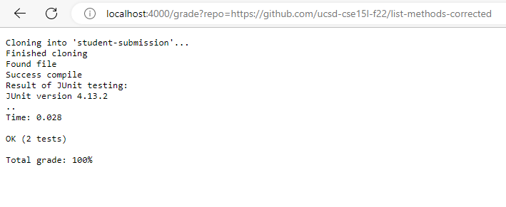
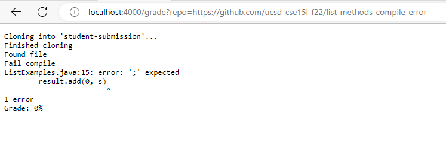

**Week 9 lab report Christopherian Austin Sulaiman**
grade.sh code block:
```
rm -rf student-submission
rm -rf autograded/
git clone $1 student-submission

mkdir autograded/
cp ./student-submission/ListExamples.java autograded/
cp TestListExamples.java autograded/
cp -r lib autograded/
cd autograded/

javac -cp .:lib/hamcrest-core-1.3.jar:lib/junit-4.13.2.jar *.java
java -cp .:lib/hamcrest-core-1.3.jar:lib/junit-4.13.2.jar org.junit.runner.JUnitCore TestListExamples.java 2> error-output.txt

javac ListExamples.java

if [ $? -eq 0 ];
 then
    echo "Succeeded!"
else
    echo "Failed!"
fi
```
image one:


image two:


image three:



I choose to trace the script for the first image:


In the first image, the exit code for the rm -rf files is 0 for success. The standard error and output for the rm -rf files for this case is NULL/empty. As the commands ran with no issues syntax-wise or technical-wise, there are no standard error message or standard out. For git clone, the exit code is 0 for success. The standard out message in this case is "Cloning into 'student-submission'...". This shows the command running with no issues. The standard error for git clone is empty. mkdir autograded/ just creates a new directory to store the autograded files. The cp command copies files and/or directories, and return an exit code of 0 upon success, and certain standard output statements that are not seen here because it ran without any issues.

Next is the javac and java command for the JUNIT tester program. This program ran javac and java for JUNIT smoothly. The commands printed out the amount of tests run and the failures there was. Furthermore, the standard output prints out this to the screen: "1) initializationError(org.junit.runner.JUnitCommandLineParseResult)
java.lang.IllegalArgumentException: Could not find class [TestListExamples.java]
	at org.junit.runner.JUnitCommandLineParseResult.parseParameters(JUnitCommandLineParseResult.java:100)
	at org.junit.runner.JUnitCommandLineParseResult.parseArgs(JUnitCommandLineParseResult.java:50)
	at org.junit.runner.JUnitCommandLineParseResult.parse(JUnitCommandLineParseResult.java:44)
	at org.junit.runner.JUnitCore.runMain(JUnitCore.java:72)
	at org.junit.runner.JUnitCore.main(JUnitCore.java:36)
Caused by: java.lang.ClassNotFoundException: TestListExamples.java
	at java.base/jdk.internal.loader.BuiltinClassLoader.loadClass(BuiltinClassLoader.java:581)
	at java.base/jdk.internal.loader.ClassLoaders$AppClassLoader.loadClass(ClassLoaders.java:178)
	at java.base/java.lang.ClassLoader.loadClass(ClassLoader.java:522)
	at java.base/java.lang.Class.forName0(Native Method)
	at java.base/java.lang.Class.forName(Class.java:398)
	at org.junit.internal.Classes.getClass(Classes.java:42)
	at org.junit.internal.Classes.getClass(Classes.java:27)
	at org.junit.runner.JUnitCommandLineParseResult.parseParameters(JUnitCommandLineParseResult.java:98)
	... 4 more". The standard error is empty for this command, as can be seen in the error-output.txt file.
    Lastly, the if loop in the end, the initial if condition was met, because the exit code returned 0. Therefore, the code echoed "Succeeded!". Any other exit code beside 0 would have resulted in an echo of "Failed!". Echo "Failed" did not run due to the exit code being 0. Only one of the if conditions could be met.
