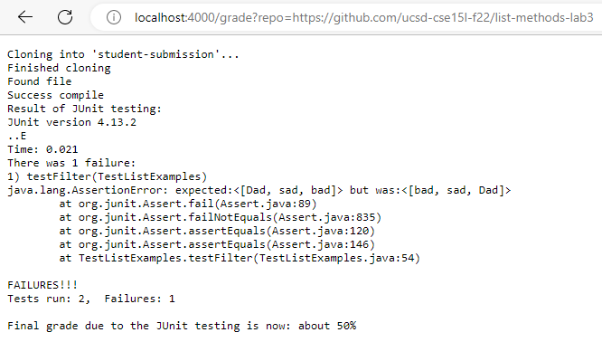

**Week 9 lab report Christopherian Austin Sulaiman**

grade.sh code block:
```
# Create your grading script here
FILE='ListExamples.java'
rm -rf student-submission
git clone $1 student-submission
echo 'Finished cloning'


cd student-submission
if [ -f $FILE ]
then
    echo "Found file"
else
    echo "Can't find file"
    echo "Grade: 0%"
    exit 1
fi

CP=".:../lib/hamcrest-core-1.3.jar:../lib/junit-4.13.2.jar"
cp ../TestListExamples.java .


javac -cp $CP *.java 2> err-text.txt
if [ $? -eq 0 ]
then
    echo "Success compile"
else
    echo "Fail compile"
    cat err-text.txt
    echo "Grade: 0%"
    exit 1
fi

java -cp $CP org.junit.runner.JUnitCore TestListExamples > result-testing.txt

if [ $? -eq 0 ]
then
    echo "Result of JUnit testing:"
    cat result-testing.txt
    echo "Total grade: 100%"
else
    echo "Result of JUnit testing:"
    cat result-testing.txt
    echo "Final grade due to the JUnit testing is now: about 50%"
    exit 1
fi
```
image one:




image two:


image three:


I choose to trace the script for the first image:


In the first image, the exit code for the rm -rf files is 0 for success. The standard error and output for the rm -rf files for this case is NULL/empty. As the commands ran with no issues syntax-wise or technical-wise, there are no standard error message or standard out. For git clone, the exit code is 0 for success. The standard out message in this case is "Cloning into 'student-submission'...". This shows the command running with no issues. The standard error for git clone is empty. The first if statement checks if the File that we are grading is already in the system after git cloning. If the file is STILL not in the system, the exit code is 1. If the file is found, the exit code is 0 and the standard err and output is empty. 

Next is the javac and java command for the JUNIT tester program. This program ran javac and java for JUNIT smoothly. The commands printed out the amount of tests run and the failures there was. I made the output of the java and javac to a new file named err-text.txt. If the compiled succeed, the exit code will be 0, giving an echo of "Success compile". Furthermore, the standard output prints out this to the screen:
 ```
JUnit version 4.13.2
.E
Time: 0.116
There was 1 failure:
1) testTimeout(TestListExamples)
org.junit.runners.model.TestTimedOutException: test timed out after 100 milliseconds
	at app//TestListExamples.testTimeout(TestListExamples.java:7)

FAILURES!!!
Tests run: 1,  Failures: 1
```
The standard error is empty for this command, as can be seen in the err-text.txt file. The standard output gives an exit code of 0 for success and 1 otherwise. Lastly, the if loop in the end, the initial if condition was not met, because the exit code returned something other than 0. Therefore, the code echoed "The final grade is now 50%", as there was a failure in JUnit testing. NOTE: in all the if statements, only one statement can be met, therefore one of the if conditions will not be run!!
